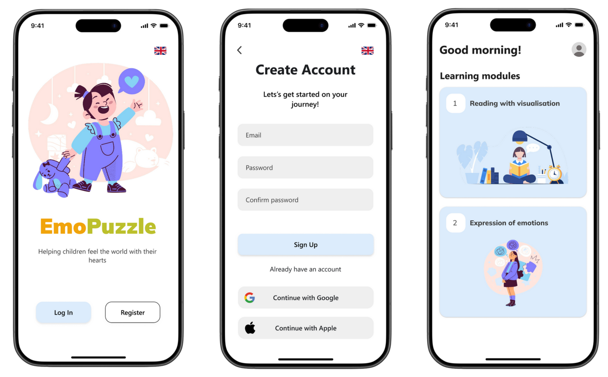

# 🧩 EmoPuzzle – Emotion Learning for Kids

**EmoPuzzle** is an interactive app designed to help children aged 6–10 — including those with autism — better understand, recognize, and express emotions. Through engaging stories and mimic-based games, the platform makes emotional learning simple, visual, and fun.

---

## 🌟 App Modes

### 📖 1. Reading with Visualisation

* A **short, randomly generated story** is displayed along with a matching **AI-generated illustration**.
* Children read the story and view the image.
* A **multiple-choice quiz** with emoji options follows, asking the child to identify the main emotion.
* Great for learning **emotion recognition** through narrative and visual cues.

### 🎭 2. Expression of Emotions

* The child chooses from a list of **situational prompts** (e.g., “You lost your toy” or “Your friend surprised you”).
* The app asks them to **mimic a specific emotion** using their camera (e.g., sad, surprised, angry).
* AI evaluates their facial expression and gives **feedback** on accuracy.

---

## 🎯 Goals

* Support **emotional development** in children.
* Assist kids with **autism or communication challenges**.
* Provide a safe, playful environment to **practice empathy and expression**.

---

## 📦 How to Use the App

You can download the latest Android version here:

👉 [**Download APK from Releases**](https://github.com/pothedev/emopuzzle-mobile/releases/tag/app)

> No installation or setup required — just download and start using.